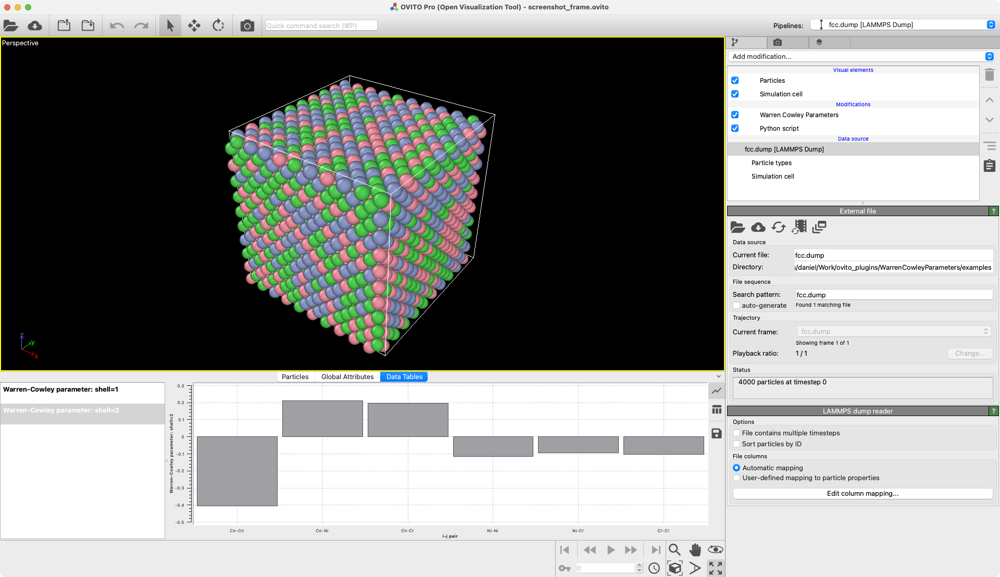

# WarrenCowleyParameters

 


OVITO Python modifier to compute the Warren-Cowley parameters, defined as:

$$\alpha_{ij}^m = 1-\frac{p_{ij}^m}{c_j},$$ 

where $m$ denotes the $m$-th nearest-neighbor shell, $p_{ij}^m$ is the average probability of finding a $j$-type atom around an $i$-type atom in the $m$-th shell, and $c_j$ is the average concentration of $j$-type atom in the system. 
A negative $\alpha_{ij}^m$ suggests the tendency of $j$-type clustering in the $m$-th shell of an $i$-type atom, while a positive value means repulsion.

## Utilisation 

Here is an example of how to compute the 1st and 2nd nearest neighbor shell Warren-Cowley parameters of the ``fcc.dump`` dump file. Note that in the fcc crystal structure, the ``1st nearest neighbor shell has 12 atoms``, while ``the second one has 6 atoms``. 

```python
from ovito.io import import_file
import WarrenCowleyParameters as wc

pipeline = import_file("fcc.dump")
mod = wc.WarrenCowleyParameters(nneigh=[0, 12, 18], only_selected=False)
pipeline.modifiers.append(mod)
data = pipeline.compute()

wc_for_shells = data.attributes["Warren-Cowley parameters"]
print(f"1NN Warren-Cowley parameters: \n {wc_for_shells[0]}")
print(f"2NN Warren-Cowley parameters: \n {wc_for_shells[1]}")


# Alternatively, can see it as a dictionarry
print(data.attributes["Warren-Cowley parameters by particle name"])

# The per-particle Warren-Cowley parameter are accessible as well
print("Per-particle 1NN Warren-Cowley parameters:\n", data.particles["Warren-Cowley parameter (shell=1)"][...])
print("Per-particle 2NN Warren-Cowley parameters:\n", data.particles["Warren-Cowley parameter (shell=2)"][...])

```
Example scripts can be found in the ``examples/`` folder.



## Installation
For a standalone Python package or Conda environment, please use:
```bash
pip install --user WarrenCowleyParameters
```

For *OVITO PRO* built-in Python interpreter, please use:
```bash
ovitos -m pip install --user WarrenCowleyParameters
```

If you want to install the lastest git commit, please replace ``WarrenCowleyParameters`` by ``git+https://github.com/killiansheriff/WarrenCowleyParameters.git``.

## Contact
If any questions, feel free to contact me (ksheriff at mit dot edu).

## References & Citing 
If you use this repository in your work, please cite:

```
@article{sheriffquantifying2024,
	title = {Quantifying chemical short-range order in metallic alloys},
	doi = {10.1073/pnas.2322962121},
	journaltitle = {Proceedings of the National Academy of Sciences},
	author = {Sheriff, Killian and Cao, Yifan and Smidt, Tess and Freitas, Rodrigo},
	date = {2024-06-18},
}
```

and 

```
@article{sheriff2024chemicalmotif,
  title = {Chemical-motif characterization of short-range order with E(3)-equivariant graph neural networks},
  DOI = {10.1038/s41524-024-01393-5},
  journal = {npj Computational Materials},
  author = {Sheriff,  Killian and Cao,  Yifan and Freitas,  Rodrigo},
  year = {2024},
  month = sep,
}
```
